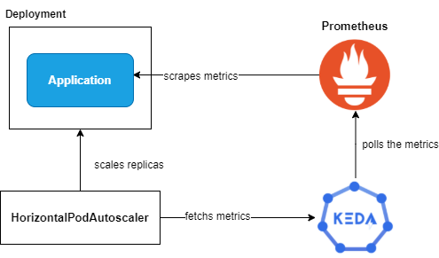

# KEDA: Autoscaling Kubernetes apps using Prometheus

This article explains how manage the autoscaling using metrics fetched from Kubernetes through KEDA: https://medium.com/@santolo.felaco/keda-autoscaling-kubernetes-apps-using-prometheus-da037fe572cf

To install the enviroment execute the following steps:

* Install Prometheus
<pre>
helm repo add prometheus-community https://prometheus-community.github.io/helm-charts 
helm repo update
kubectl create namespace prometheus
helm install -f kube-prometheus/values.yaml -n prometheus prometheus prometheus-community/kube-prometheus-stack 
</pre>

* Install KEDA

<pre>
helm repo add kedacore https://kedacore.github.io/charts
helm repo update
kubectl create namespace keda
helm install keda kedacore/keda --namespace keda
</pre>

* Install the demo app
<pre>
helm install keda-demo .
</pre>
